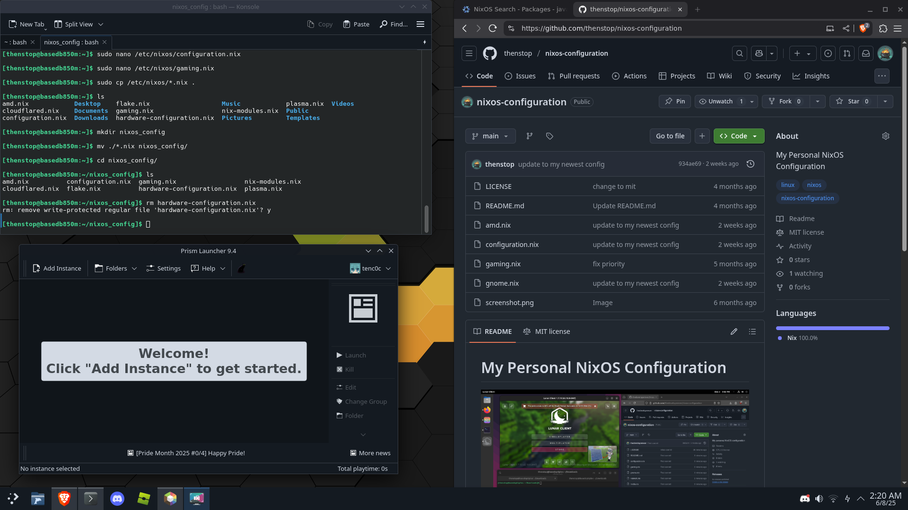

# My Personal NixOS Configuration



This is my configuration for NixOS. It works well for me and you can change anything you like for your own needs. Its free software so that is encouraged! :^)

## Contents

### hardware-configuration.nix not included, it should be created upon install (instead of using mine ofc)

- [Configuration.nix](configuration.nix) - `/etc/nixos/configuration.nix` - Main configuration file: handles stuff such as bootloader information and kernel version
- [ZRAM.nix](zram.nix) - `/etc/nixos/zram.nix` - zram configuration file: handles ssd trimming and creates 2 zstd-compressed swap devices that equal the amount of system memory
- [NVIDIA.nix](nvidia.nix) - `/etc/nixos/nvidia.nix` - NVIDIA Driver Configuration file: handles power management and my tweaks for optimal latency
- [Gaming.nix](gaming.nix) - `/etc/nixos/gaming.nix` - Gaming Configuration file: handles sysctl values and other QOL improvements for a smooth gaming experience
- [Gnome.nix](gnome.nix) - `/etc/nixos/gnome.nix` - GNOME Desktop Configuration file: handles my extensions and also removes apps that I personally don't need

## How to install

```sh
git clone https://github.com/thedeveloperever/nix-configuration.git
cd nix-configuration
sudo cp *.nix /etc/nixos/
```
